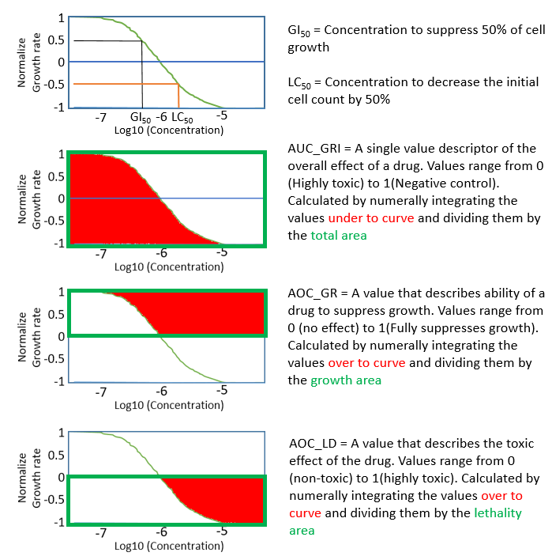

# drexplorer2

[](https://travis-ci.org/tidymodels/recipes)
[](https://codecov.io/github/tidymodels/recipes?branch=master)
[](http://cran.r-project.org/web/packages/recipes)
[](http://cran.rstudio.com/package=recipes)
[](https://www.tidyverse.org/lifecycle/#maturing)


## Introduction

The **drexplorer2** R package is developed to facilitate the analysis of dose-response data. It can be used to:

* assess the reproducibility of replicates, 
* detect outlier data points
* fit different models
* select the best model
* estimate IC (Inhibition Concentration, e.g. IC50) values at different percentiles
* evaluate drug-drug interactions using interaction index
* implement NCI 60 method (estimation of GI50, TGI, LD50 and calculation of **AOC_GR**, **AOC_LD**, **AUC_GRI**) 
* implement Hill equation (Estimation of EC50, Emax, Einf, E0 and Hill slope) 
* Calculate AUC (Area Under Curve) for all models 

A figure summary of its functions can be found from our paper (figure cited from PubMed Central):




## Installation

The [**devtools** package](http://cran.r-project.org/web/packages/devtools/index.html) is used to install R packages hosted on Github. To install **drexplorer2**, type the following commands in the R console:

```r
library(devtools)
install_github("lshen1/drexplorer2")
```

## Usage
```r
# load the package
library(drexplorer2)
	
# pull out vignette: vignette does not pull out correctly if installed on Linux with non-root (R>3.0)
# instead, check vignette at: http://htmlpreview.github.com/?https://github.com/nickytong/drexplorer/blob/master/inst/doc/drexplorer.html
vignette('drexplorer2')
	
# GUI for dose-response curve fitting
drexplorerGUI_1()
	
# GUI for drug-drug interaction
drexplorerGUI_2()
``` 

## User Manual
A [manual](http://htmlpreview.github.io/?https://github.com/lshen1/drexplorer2/blob/master/docs/index.html) is available. This is the same document as shown by typing the following command in R console.

